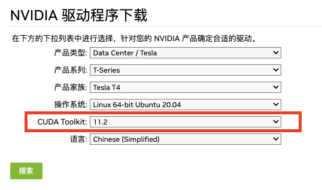

# 背景

最近在学习AI相关知识，需要使用 gpu 运行 tensorflow 代码，选择在腾讯云上搭建环境

# 要点总结

## 1 版本号对齐
安装 tensorflow 与 GPU 支持需要对齐以下软件的版本号（按依赖顺序排列）：
- GPU 驱动版本号
- CUDA 版本号
- cudnn 版本号
- tensorflow 版本号

由于 tensorflow 位于最下游，因此更新时机最晚，因此实际安装时应从 tensorflow 的版本号反向推导上游的版本号信息。
各软件包的版本号可以参见 tensorflow 的[官方网站](https://www.tensorflow.org/install/source?hl=zh-cn#gpu)


GPU驱动的版本号，可以通过[驱动下载页](https://www.nvidia.cn/Download/index.aspx?lang=cn)查看。
需要找到适配目标CUDA版本的驱动版本




## 2 环境安装

### 2.1 使用腾讯云自动安装环境

在腾讯云上创建 GPU 实例时，可以选择 GPU驱动、cuda、cudnn版本号，在实例启动后自动安装。需要注意的是腾讯云默认的版本号并没有对齐，
需要自动调整需要的版本号


这里我们的操作系统选择了 20.04 而不是最近的 22.04 ，就是因为 22.04 的 GPU 驱动最低支持的 cuda 版本是 11.7 ，
与 tensorflow 的 cuda 版本不匹配

环境安装好后，按[安装手册](https://www.tensorflow.org/install/pip?hl=zh-cn)中的描述，使用 pip 安装 tensorflow 即可

```shell
pip install tensorflow==2.4.0
```

### 2.2 手动安装环境

> 本次安装的目标版本如下表

| python | tensorflow | cudnn | cuda | nvidia driver |
| ------ | ---------- | ----- | ---- | ------------- |
| 3.9    | 2.6.0      | 8.1   | 11.2 | 460.106.00    |


#### a.安装 N 卡驱动

按[安装手册](https://docs.nvidia.com/datacenter/tesla/tesla-installation-notes/index.html)中说明安装驱动。
需要注意的是安装手册中的驱动安装命令，需要替换成你需要的驱动版本

```shell
sudo apt-get -y install cuda-drivers-460
```

由于ubuntu 系统安装后，有默认的驱动，在安装 Nvidia 驱动后禁用默认驱动`nouveau`:
打开`/etc/modprobe.d/blacklist.conf`文件，并添加以下内容：

```conf
blacklist nouveau
options nouveau modeset=0
```

然后重启服务器，并输入`nvidia-smi`命令，当出现以下输出时，说明 nvidia 驱动已启用

```text
+-----------------------------------------------------------------------------+
| NVIDIA-SMI 460.106.00   Driver Version: 460.106.00   CUDA Version: 11.2     |
|-------------------------------+----------------------+----------------------+
| GPU  Name        Persistence-M| Bus-Id        Disp.A | Volatile Uncorr. ECC |
| Fan  Temp  Perf  Pwr:Usage/Cap|         Memory-Usage | GPU-Util  Compute M. |
|                               |                      |               MIG M. |
|===============================+======================+======================|
|   0  Tesla T4            On   | 00000000:00:08.0 Off |                    0 |
| N/A   33C    P8     9W /  70W |      4MiB / 15109MiB |      0%      Default |
|                               |                      |                  N/A |
+-------------------------------+----------------------+----------------------+
                                                                               
+-----------------------------------------------------------------------------+
| Processes:                                                                  |
|  GPU   GI   CI        PID   Type   Process name                  GPU Memory |
|        ID   ID                                                   Usage      |
|=============================================================================|
|    0   N/A  N/A      1454      G   /usr/lib/xorg/Xorg                  4MiB |
+-----------------------------------------------------------------------------+
```

### b.安装 cuda

按[安装手册](https://docs.nvidia.com/cuda/cuda-installation-guide-linux/index.html#package-manager-installation)描述安装cuda，同样的安装命令需要替换成目标版本。

```shell
sudo apt install cuda-toolkit-11-2
```

cuda 的安装时间比较长，为避免断开连接，可以使用 tmux 管理会话

### c.安装 cudnn

按[安装手册](https://docs.nvidia.com/deeplearning/cudnn/install-guide/index.html)描述安装 cudnn。
cudnn 的可用版本号可以通过`apt-cache`命令查看，然后选择对应的版本

```shell
apt-cache madison libcudnn8 | grep 11.2
cudnn_version=8.1.1.33 && cuda_version=cuda11.2
```

### d.安装 tensorflow

按[安装手册](https://www.tensorflow.org/install/pip?hl=zh-cn)中的描述创建虚环境，并安装 tensorflow。

```shell
pip install tensorflow==2.6.0
```


## 3 检查环境安装结果

安装 tensorflow
```shell
pip install tensorflow==2.4.0
```

执行 python 代码
```python
import tensorflow as tf
print(tf.config.list_physical_devices('GPU'))
```

得到以下输出，说明环境安装成功
```text
[PhysicalDevice(name='/physical_device:GPU:0', device_type='GPU')]
```