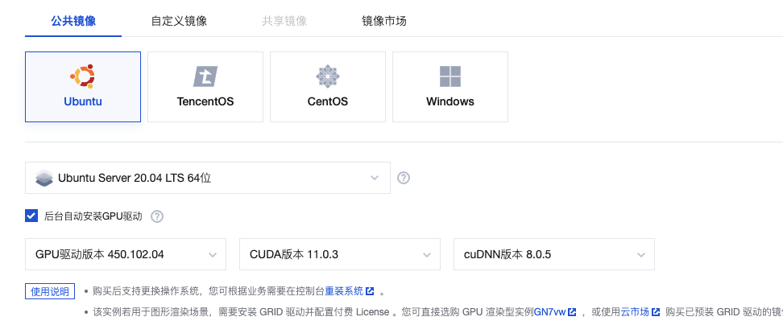

> 整理一次成功的安装过程以及注意事项

# 背景

最近在学习AI相关知识，需要使用 gpu 运行 tensorflow 代码，选择在腾讯云上搭建环境

# 要点总结

## 1 版本号对齐
安装 tensorflow 与 GPU 支持需要对齐以下软件的版本号（按依赖顺序排列）：
- GPU 驱动版本号 <[驱动下载地址](https://www.nvidia.cn/Download/index.aspx?lang=cn)>
- CUDA 版本号 <[安装手册](https://docs.nvidia.com/cuda/cuda-installation-guide-linux/index.html#package-manager-installation)>
- cudnn 版本号 <[安装手册](https://docs.nvidia.com/deeplearning/cudnn/install-guide/index.html)>
- tensorflow 版本号 <[安装手册](https://www.tensorflow.org/install/pip?hl=zh-cn)>

由于 tensorflow 位于最下游，因此更新时机最晚，因此实际安装时应从 tensorflow 的版本号反向推导上游的版本号信息。
各软件包的版本号可以参见 tensorflow 的[官方网站](https://www.tensorflow.org/install/source?hl=zh-cn#gpu)


## 2 使用腾讯云自动安装环境

在腾讯云上创建 GPU 实例时，可以选择 GPU驱动、cuda、cudnn版本号，在实例启动后自动安装。需要注意的是腾讯云默认的版本号并没有对齐，
需要自动调整需要的版本号



这里我们的操作系统选择了 20.04 而不是最近的 22.04 ，就是因为 22.04 的 GPU 驱动最低支持的 cuda 版本是 11.7 ，
与 tensorflow 的 cuda 版本不匹配

环境安装好后，使用 pip 安装 tensorflow 即可

## 3 手动安装环境

### 3.1 安装 N 卡驱动

按安装手册描述安装驱动。

由于ubuntu 系统安装后，有默认的驱动，在安装 Nvidia 驱动后禁用默认驱动，重启后 N 卡驱动才会生效

打开`/etc/modprobe.d/blacklist.conf`文件，并添加以下内容：

```text
blacklist nouveau
options nouveau modeset=0
```

### 3.2 安装其他软件包

按照安装手册安装各软件包